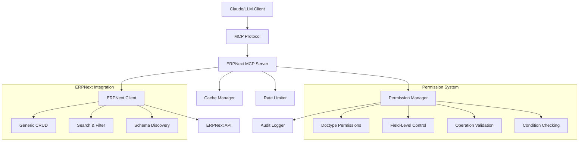

# ERPNext MCP Server

A comprehensive **Model Context Protocol (MCP) server** for ERPNext that provides **generic, doctype-agnostic access** to any ERPNext document type with **robust permission controls**, **audit logging**, and **enterprise-grade security**.

## 🏗️ Architecture Overview



### Core Components

- **🔧 Generic Client**: Works with any ERPNext doctype (Customer, Item, Sales Order, etc.)
- **🛡️ Permission System**: Multi-layer access control with field-level restrictions
- **📊 Audit System**: Comprehensive logging of all operations
- **⚡ Performance**: Built-in caching and rate limiting
- **🔍 Discovery**: Dynamic tool generation based on configured doctypes

## 🚀 Quick Start

### 1. Installation

```bash
# Clone/create project
mkdir erpnext_mcp_server && cd erpnext_mcp_server

# Create virtual environment
python -m venv venv
source venv/bin/activate  # Windows: venv\Scripts\activate

# Install dependencies
pip install mcp httpx pydantic python-dotenv typing-extensions
```

### 2. Configuration

Create `config/config.json`:

```json
{
  "erpnext": {
    "url": "https://your-erpnext-instance.com",
    "api_key": "your_api_key",
    "api_secret": "your_api_secret"
  },
  "permissions": {
    "doctypes": {
      "Customer": {
        "read": true,
        "create": true,
        "update": true,
        "delete": false,
        "allowed_fields": ["customer_name", "email_id", "mobile_no"],
        "conditions": {
          "create": {"customer_type": ["Company", "Individual"]}
        }
      }
    }
  }
}
```

### 3. Run Server

```bash
python -m src.server
```

## 🔐 Permission Model

### Multi-Layer Security Architecture

The permission system operates on **four security layers**:

#### 1. **Operation-Level Permissions**
```json
{
  "Customer": {
    "read": true,     // Allow reading customers
    "create": true,   // Allow creating customers  
    "update": true,   // Allow updating customers
    "delete": false   // Deny deleting customers
  }
}
```

#### 2. **Field-Level Access Control**
```json
{
  "Customer": {
    "allowed_fields": [
      "customer_name", "email_id", "mobile_no", "website"
    ],
    "restricted_fields": [
      "creation", "modified", "owner", "credit_limit"
    ]
  }
}
```

#### 3. **Conditional Validation**
```json
{
  "Customer": {
    "conditions": {
      "create": {
        "customer_type": ["Company", "Individual"],
        "territory": ["Egypt", "UAE", "Saudi Arabia"]
      },
      "update": {
        "status": {"not_in": ["Disabled", "Blocked"]}
      }
    }
  }
}
```

#### 4. **Audit & Monitoring**
```json
{
  "audit": {
    "enabled": true,
    "log_file": "logs/audit.log",
    "retention_days": 30
  }
}
```

### Permission Examples

#### **Restrictive Configuration** (Read-only analyst)
```json
{
  "permissions": {
    "doctypes": {
      "Customer": {
        "read": true,
        "create": false,
        "update": false,
        "delete": false,
        "allowed_fields": ["name", "customer_name", "territory", "customer_group"]
      },
      "Sales Invoice": {
        "read": true,
        "create": false,
        "update": false,
        "delete": false,
        "allowed_fields": ["name", "customer", "total", "status", "posting_date"]
      }
    }
  }
}
```

#### **Operational Configuration** (Sales user)
```json
{
  "permissions": {
    "doctypes": {
      "Customer": {
        "read": true,
        "create": true,
        "update": true,
        "delete": false,
        "allowed_fields": [
          "customer_name", "customer_type", "email_id", "mobile_no",
          "customer_group", "territory", "website"
        ],
        "conditions": {
          "create": {"customer_type": ["Company", "Individual"]},
          "update": {"status": {"not_in": ["Disabled"]}}
        }
      }
    }
  }
}
```

## 🛠️ Available Tools & Usage

### System Tools

#### `test_connection`
Test ERPNext server connectivity
```
Test the ERPNext connection
```

#### `list_doctypes` 
Show all configured doctypes and permissions
```
List all available document types and their permissions
```

#### `get_doctype_permissions`
Get detailed permissions for specific doctype
```
Show me the permissions for Customer doctype
```

### Generic Document Operations

#### `get_generic_document`
Get any document by doctype and name
```
Get the Customer document named "ABC Company"
```

#### `list_generic_documents`  
List documents for any doctype with filters
```
List all Items where item_group is "Raw Materials" and limit to 10 results
```

#### `create_generic_document`
Create document for any doctype
```
Create a new Customer with name "XYZ Corp", type "Company", and email "contact@xyz.com"
```

### Doctype-Specific Tools

For each configured doctype, the server automatically generates:

- `list_{doctype}_documents` - List documents
- `get_{doctype}_document` - Get specific document
- `search_{doctype}_documents` - Search documents
- `create_{doctype}_document` - Create new document  
- `update_{doctype}_document` - Update document
- `delete_{doctype}_document` - Delete document (if permitted)

### Example Usage with Claude

#### **Data Analysis**
```
Show me the top 10 customers by territory and their contact information
```
→ Uses `list_customer_documents` with filters

#### **Data Entry**
```  
Create a new customer named "Tech Solutions Ltd" as a Company type in Egypt territory with email info@techsolutions.com
```
→ Uses `create_customer_document` with validation

#### **Information Retrieval**
```
Get details for sales invoice INV-2024-001 including customer and payment status  
```
→ Uses `get_sales_invoice_document`

#### **Search & Discovery**
```
Find all items containing "laptop" in the name and show their prices
```
→ Uses `search_item_documents`

## ⚙️ Advanced Configuration

### Rate Limiting
```json
{
  "rate_limiting": {
    "enabled": true,
    "requests_per_minute": 60,
    "requests_per_hour": 1000
  }
}
```

### Caching
```json
{
  "cache": {
    "enabled": true,
    "ttl": 300,
    "max_size": 1000
  }
}
```

### Environment Variables
```bash
# Alternative to config file
export ERPNEXT_URL="https://your-instance.com"
export ERPNEXT_API_KEY="your_key"
export ERPNEXT_API_SECRET="your_secret"
export MCP_AUDIT_ENABLED="true"
export MCP_LOG_LEVEL="INFO"
```

## 🔒 Security Considerations

### Authentication
- Uses ERPNext API Key/Secret authentication
- No passwords stored in configuration
- Supports ERPNext user-level permissions

### Data Protection  
- Field-level access control prevents sensitive data exposure
- Audit logging tracks all access attempts
- Rate limiting prevents abuse
- Input validation prevents injection attacks

### Network Security
- HTTPS-only connections to ERPNext
- Configurable request timeouts
- Connection pooling with limits

### Audit Trail
All operations are logged with:
- Timestamp and user context
- Operation type and target doctype  
- Success/failure status and reasons
- Data accessed/modified (field names only)
- IP address and session information

Example audit log:
```
2024-01-15 10:30:45 - INFO - Operation: READ | DocType: Customer | Result: ALLOWED | Document: ABC Corp | Fields: ['customer_name', 'email_id', 'territory']
2024-01-15 10:31:12 - WARNING - Operation: DELETE | DocType: Customer | Result: DENIED | Reason: Delete operation not allowed for doctype 'Customer'
```

## 🧪 Testing & Validation

### Test Connection
```bash
python test_client.py
```

### Validate Permissions
```python
from src.permissions import PermissionManager

config = {...}  # Your config
pm = PermissionManager(config)

# Test permissions
can_read = pm.can_read("Customer")
can_create = pm.can_create("Sales Order") 
allowed_fields = pm.get_allowed_fields("Item")

# Validate operation
allowed, reason = pm.validate_operation("create", "Customer", {
    "customer_name": "Test Corp",
    "customer_type": "Company"
})
```

### Performance Testing
```python
import asyncio
from src.erpnext_client import ERPNextClient

# Test rate limiting and caching
client = ERPNextClient(url, key, secret, config)

# This should hit cache after first request
for i in range(10):
    result = await client.get_doctype_list("Customer")
    print(f"Request {i+1}: {len(result['data'])} customers")
```

## 🏃‍♂️ Deployment

### Production Configuration
```json
{
  "erpnext": {
    "url": "https://your-production-instance.com",
    "timeout": 60
  },
  "rate_limiting": {
    "enabled": true,  
    "requests_per_minute": 30,
    "requests_per_hour": 500
  },
  "audit": {
    "enabled": true,
    "log_level": "INFO",
    "retention_days": 90
  },
  "cache": {
    "enabled": true,
    "ttl": 600
  }
}
```

### Claude Desktop Integration
Add to `claude_desktop_config.json`:
```json
{
  "mcpServers": {
    "erpnext": {
      "command": "python",
      "args": ["-m", "src.server"],
      "cwd": "/path/to/erpnext_mcp_server",
      "env": {
        "MCP_LOG_LEVEL": "INFO"
      }
    }
  }
}
```

### Docker Deployment
```dockerfile
FROM python:3.11-slim

WORKDIR /app
COPY requirements.txt .
RUN pip install -r requirements.txt

COPY . .
EXPOSE 8080

CMD ["python", "-m", "src.server"]
```

## 🚨 Failure Modes & Recovery

### Connection Failures
- Automatic retry with exponential backoff
- Graceful degradation when ERPNext is unavailable  
- Connection pooling prevents resource exhaustion

### Permission Violations
- All unauthorized operations are blocked and logged
- Clear error messages explain permission requirements
- No partial operations - atomic success/failure

### Rate Limiting
- Adjust rate limiting settings in config
- Implement caching for frequent requests
