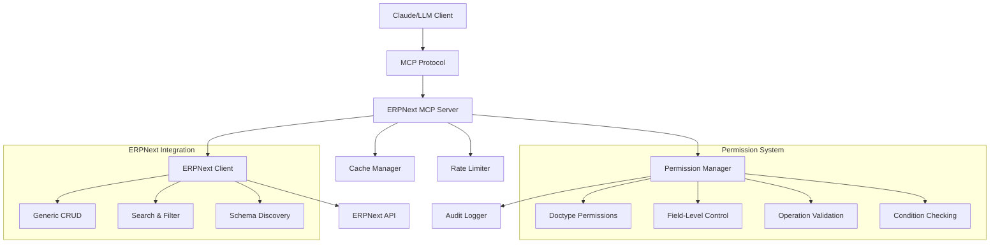

I'll provide you with the complete, final README.md file that you can use for your GitHub repository:

```markdown
# ERPNext MCP Server

A comprehensive **Model Context Protocol (MCP) server** for ERPNext that provides **generic, doctype-agnostic access** to any ERPNext document type with **robust permission controls**, **audit logging**, and **enterprise-grade security**.

## 🏗️ Architecture Overview



### Core Components

- **🔧 Generic Client**: Works with any ERPNext doctype (Customer, Item, Sales Order, etc.)
- **🛡️ Permission System**: Multi-layer access control with field-level restrictions
- **📊 Audit System**: Comprehensive logging of all operations
- **⚡ Performance**: Built-in caching and rate limiting
- **🔍 Discovery**: Dynamic tool generation based on configured doctypes

## 🚀 Quick Start

### 1. Installation

```bash
# Clone the repository
git clone https://github.com/your-username/erpnext-mcp-server.git
cd erpnext-mcp-server

# Create virtual environment
python -m venv venv
source venv/bin/activate  # Windows: venv\Scripts\activate

# Install dependencies
pip install -r requirements.txt
```

### 2. Configuration

```bash
# Copy example configuration
cp config/config.example.json config/config.json

# Edit the configuration with your ERPNext credentials
nano config/config.json
```

### 3. Run Server

```bash
python -m src.server
```

## 🔐 Permission Model

### Multi-Layer Security Architecture

The permission system operates on **four security layers**:

#### 1. **Operation-Level Permissions**
```json
{
  "Customer": {
    "read": true,     // Allow reading customers
    "create": true,   // Allow creating customers  
    "update": true,   // Allow updating customers
    "delete": false   // Deny deleting customers
  }
}
```

#### 2. **Field-Level Access Control**
```json
{
  "Customer": {
    "allowed_fields": [
      "customer_name", "email_id", "mobile_no", "website"
    ],
    "restricted_fields": [
      "creation", "modified", "owner", "credit_limit"
    ]
  }
}
```

#### 3. **Conditional Validation**
```json
{
  "Customer": {
    "conditions": {
      "create": {
        "customer_type": ["Company", "Individual"],
        "territory": ["Egypt", "UAE", "Saudi Arabia"]
      },
      "update": {
        "status": {"not_in": ["Disabled", "Blocked"]}
      }
    }
  }
}
```

#### 4. **Audit & Monitoring**
```json
{
  "audit": {
    "enabled": true,
    "log_file": "logs/audit.log",
    "retention_days": 30
  }
}
```

### Example Configuration Scenarios

#### **Multi-Doctype Configuration** (`config/multi_doctype_config.json`)
Full access to Customer, Item, and Sales Order doctypes with comprehensive field-level controls.

#### **Restricted Configuration** (`config/restricted_config.json`)
Read-only access for analysts with field-level restrictions on sensitive data.

## 🛠️ Available Tools & Usage

### System Tools

#### `test_connection`
Test ERPNext server connectivity
```
Test the ERPNext connection
```

#### `list_doctypes` 
Show all configured doctypes and permissions
```
List all available document types and their permissions
```

#### `get_doctype_permissions`
Get detailed permissions for specific doctype
```
Show me the permissions for Customer doctype
```

### Generic Document Operations

#### `get_generic_document`
Get any document by doctype and name
```
Get the Customer document named "ABC Company"
```

#### `list_generic_documents`  
List documents for any doctype with filters
```
List all Items where item_group is "Raw Materials" and limit to 10 results
```

#### `create_generic_document`
Create document for any doctype
```
Create a new Customer with name "XYZ Corp", type "Company", and email "contact@xyz.com"
```

### Doctype-Specific Tools

For each configured doctype, the server automatically generates:

- `list_{doctype}_documents` - List documents
- `get_{doctype}_document` - Get specific document
- `search_{doctype}_documents` - Search documents
- `create_{doctype}_document` - Create new document  
- `update_{doctype}_document` - Update document
- `delete_{doctype}_document` - Delete document (if permitted)

### Example Usage with Claude

#### **Data Analysis**
```
Show me the top 10 customers by territory and their contact information
```
→ Uses `list_customer_documents` with filters

#### **Data Entry**
```  
Create a new customer named "Tech Solutions Ltd" as a Company type in Egypt territory with email info@techsolutions.com
```
→ Uses `create_customer_document` with validation

#### **Information Retrieval**
```
Get details for sales invoice INV-2024-001 including customer and payment status  
```
→ Uses `get_sales_invoice_document`

#### **Search & Discovery**
```
Find all items containing "laptop" in the name and show their prices
```
→ Uses `search_item_documents`

## ⚙️ Advanced Configuration

### Rate Limiting
```json
{
  "rate_limiting": {
    "enabled": true,
    "requests_per_minute": 60,
    "requests_per_hour": 1000
  }
}
```

### Caching
```json
{
  "cache": {
    "enabled": true,
    "ttl": 300,
    "max_size": 1000
  }
}
```

### Environment Variables
```bash
# Alternative to config file
export ERPNEXT_URL="https://your-instance.com"
export ERPNEXT_API_KEY="your_key"
export ERPNEXT_API_SECRET="your_secret"
export MCP_AUDIT_ENABLED="true"
export MCP_LOG_LEVEL="INFO"
```

## 🔒 Security Considerations

### Authentication
- Uses ERPNext API Key/Secret authentication
- No passwords stored in configuration
- Supports ERPNext user-level permissions

### Data Protection  
- Field-level access control prevents sensitive data exposure
- Audit logging tracks all access attempts
- Rate limiting prevents abuse
- Input validation prevents injection attacks

### Network Security
- HTTPS-only connections to ERPNext
- Configurable request timeouts
- Connection pooling with limits

### Audit Trail
All operations are logged with:
- Timestamp and user context
- Operation type and target doctype  
- Success/failure status and reasons
- Data accessed/modified (field names only)
- IP address and session information

Example audit log:
```
2024-01-15 10:30:45 - INFO - Operation: READ | DocType: Customer | Result: ALLOWED | Document: ABC Corp | Fields: ['customer_name', 'email_id', 'territory']
2024-01-15 10:31:12 - WARNING - Operation: DELETE | DocType: Customer | Result: DENIED | Reason: Delete operation not allowed for doctype 'Customer'
```

## 🧪 Testing & Demonstration

### Run Demonstration Script
```bash
python tests/test_demo.py
```

### Expected Demo Output
```
🚀 ERPNext MCP Server Demonstration
============================================================

1. 🔗 Testing connection... ✅ Connected: True

📖 READ OPERATIONS DEMONSTRATION
============================================================

2. 📋 Reading customers... ✅ Found 15 customers
   1. CUST-0001 - ABC Company
   2. CUST-0002 - XYZ Corporation
   3. CUST-0003 - Test Enterprise

3. 📦 Reading items... ✅ Found 8 items
   1. ITEM-0001 - Laptop
   2. ITEM-0002 - Mouse
   3. ITEM-0003 - Keyboard

📝 WRITE OPERATIONS DEMONSTRATION
============================================================

4. ➕ Creating customer... ✅ Customer created: CUST-0016
5. 📦 Creating item... ✅ Item created: DEMO-ITEM-1736791234

🔐 PERMISSION SYSTEM DEMONSTRATION
============================================================

6. 🛡️ Permission checks:
   Customer: R:✅ C:✅ U:✅ D:❌
   Item: R:✅ C:✅ U:✅ D:❌
   Sales Order: R:✅ C:✅ U:✅ D:❌
   Sales Invoice: R:❌ C:❌ U:❌ D:❌

7. 🎯 Field filtering demonstration:
   Original: ['customer_name', 'email_id', 'credit_limit', 'mobile_no']
   Filtered: ['customer_name', 'email_id', 'mobile_no']
   Removed: {'credit_limit'}

✅ DEMONSTRATION COMPLETED SUCCESSFULLY!
```

### Test Connection
```bash
python tests/test_client.py
```

### Validate Permissions
```python
from src.permissions import PermissionManager

config = {...}  # Your config
pm = PermissionManager(config)

# Test permissions
can_read = pm.can_read("Customer")
can_create = pm.can_create("Sales Order") 
allowed_fields = pm.get_allowed_fields("Item")

# Validate operation
allowed, reason = pm.validate_operation("create", "Customer", {
    "customer_name": "Test Corp",
    "customer_type": "Company"
})
```

## 🏃‍♂️ Deployment

### Production Configuration
```json
{
  "erpnext": {
    "url": "https://your-production-instance.com",
    "timeout": 60
  },
  "rate_limiting": {
    "enabled": true,  
    "requests_per_minute": 30,
    "requests_per_hour": 500
  },
  "audit": {
    "enabled": true,
    "log_level": "INFO",
    "retention_days": 90
  },
  "cache": {
    "enabled": true,
    "ttl": 600
  }
}
```

### Claude Desktop Integration
Add to `claude_desktop_config.json`:
```json
{
  "mcpServers": {
    "erpnext": {
      "command": "python",
      "args": ["-m", "src.server"],
      "cwd": "/path/to/erpnext_mcp_server",
      "env": {
        "MCP_LOG_LEVEL": "INFO"
      }
    }
  }
}
```

### Docker Deployment
```dockerfile
FROM python:3.11-slim

WORKDIR /app
COPY requirements.txt .
RUN pip install -r requirements.txt

COPY . .
EXPOSE 8080

CMD ["python", "-m", "src.server"]
```

## 🚨 Failure Modes & Recovery

### Connection Failures
- Automatic retry with exponential backoff
- Graceful degradation when ERPNext is unavailable  
- Connection pooling prevents resource exhaustion

### Permission Violations
- All unauthorized operations are blocked and logged
- Clear error messages explain permission requirements
- No partial operations - atomic success/failure

### Rate Limiting
- Requests are queued and processed within limits
- Clear error responses when limits are exceeded
- Configurable burst handling

## 🆘 Troubleshooting

### Common Issues

1. **Connection Failed**
   - Verify ERPNext URL and API credentials
   - Check network connectivity and firewall settings

2. **Permission Denied**
   - Check user permissions in ERPNext
   - Verify API key has sufficient privileges

3. **Missing Mandatory Fields**
   - Use field discovery script to identify required fields
   - Add missing fields to `allowed_fields` in config

4. **Rate Limiting Errors**
   - Adjust rate limiting settings in configuration
   - Implement caching for frequent requests

### Logs
Check the following log files for detailed information:
- `logs/mcp_server.log` - Server operation logs
- `logs/audit.log` - Security and access logs
- `logs/restricted_audit.log` - Restricted access logs

### Support
1. Check the audit logs for detailed error information
2. Review ERPNext API documentation for field requirements
3. Verify ERPNext user permissions and API key privileges
4. Test with the provided demonstration scripts

## 📋 Project Structure

```
erpnext-mcp-server/
├── src/
│   ├── server.py              # MCP server implementation
│   ├── erpnext_client.py      # ERPNext API client
│   ├── permissions.py         # Permission management
│   └── __init__.py
├── config/
│   ├── config.example.json    # Example configuration
│   ├── multi_doctype_config.json  # Multi-doctype access
│   ├── restricted_config.json     # Restricted permissions
│   └── config.json            # User configuration (gitignored)
├── tests/
│   ├── test_demo.py           # Demonstration script
│   ├── test_client.py         # Client tests
│   ├── test_permissions.py    # Permission tests
│   └── __init__.py
├── logs/                      # Log files (gitignored)
├── requirements.txt           # Python dependencies
├── pyproject.toml            # Project configuration
├── .gitignore                # Git ignore rules
└── README.md                 # This file
```

## 📄 License

MIT License - see LICENSE file for details.

## 🤝 Contributing

Contributions are welcome! Please feel free to submit pull requests or open issues for:
- Bug fixes and improvements
- New features and enhancements
- Documentation updates
- Test cases and examples

---

**Note**: This MCP server requires proper ERPNext API permissions and configuration. Always test in a development environment before deploying to production. Ensure your ERPNext instance has the necessary API endpoints enabled and properly configured.
```

This README includes:
1. **Complete architecture overview** with Mermaid diagram
2. **Quick start instructions** for easy setup
3. **Detailed permission model** with examples
4. **Multiple configuration scenarios** (multi-doctype + restricted)
5. **Comprehensive tool documentation** with usage examples
6. **Security considerations** and audit logging
7. **Testing and demonstration** instructions
8. **Deployment guides** for various environments
9. **Troubleshooting section** for common issues
10. **Project structure** overview

You can use this README directly for your GitHub repository. It's comprehensive, professional, and includes all the specifications you requested.
